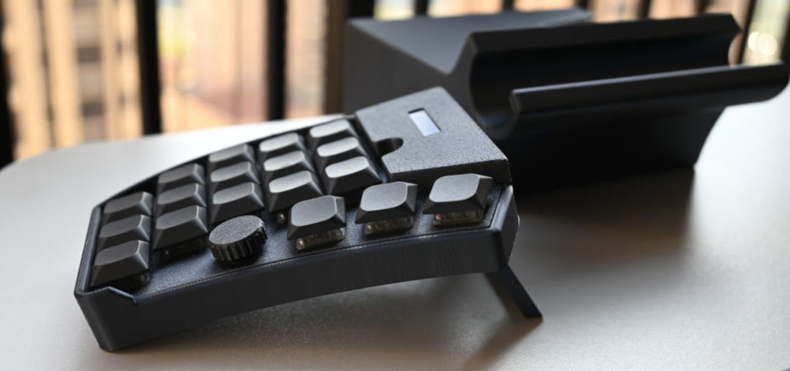
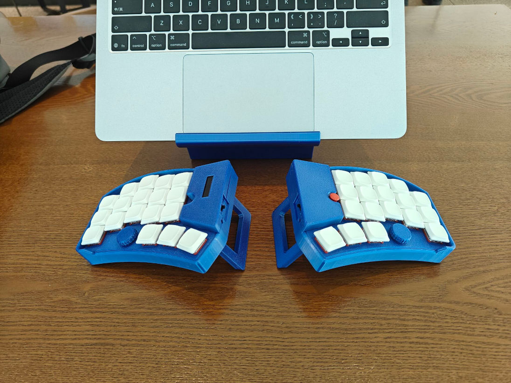

# pskeeb5

A keyboard crafted for uncompromising typists who value efficiency and ergonomics.

- **Ergonomic Split & Tilted Design**: Promotes natural hand posture.
- **Dual-Purpose Travel Case**: Protects your keyboard and transforms into a laptop riser.
- **Wireless Freedom**: Bluetooth connectivity for a clean setup.
- **Precision Control**: Integrated Trackpoint with adjustable sensitivity.
- **Travel-Ready**: Dedicated power switch to preserve battery life on the go.
- **Status at a Glance**: OLED displays on both halves for instant feedback.

## Build Guide

### Step 1: BOM Preparation

1. Download the latest gerber zip file in the [pcb](pcb) folder and place an order with a **PCB thickness of 1.6mm**.
2. Make sure you have all components described in the [bom](bom) README.md ready.

### Step 2: Print the Case

1. Download the latest case 3D printing files in the [case](case) directory.
2. Print all plates. Note that the top plate must use a finer printing quality to ensure a proper fit with other components.

### Step 3: Soldering

*Video guide coming soon.*

### Step 4: Assembling

*Video guide coming soon.*

### Step 5: Flash Firmware & Test

*Video guide coming soon.*

### Step 6: Configurator - ZMK Studio

*Video guide coming soon.*
