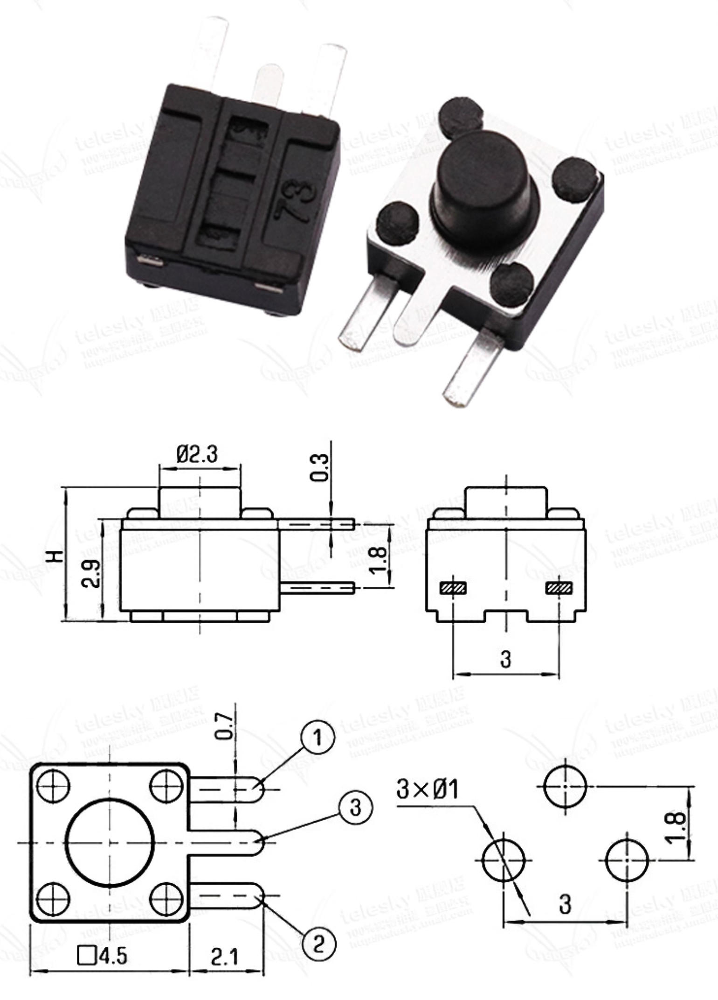
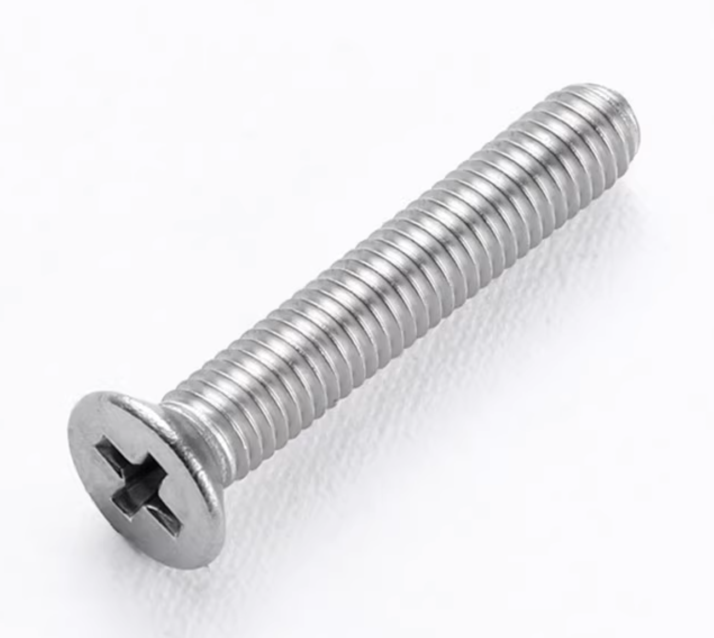
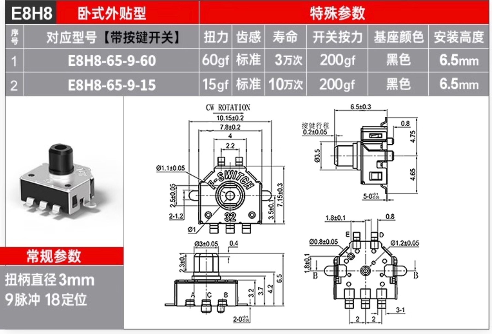
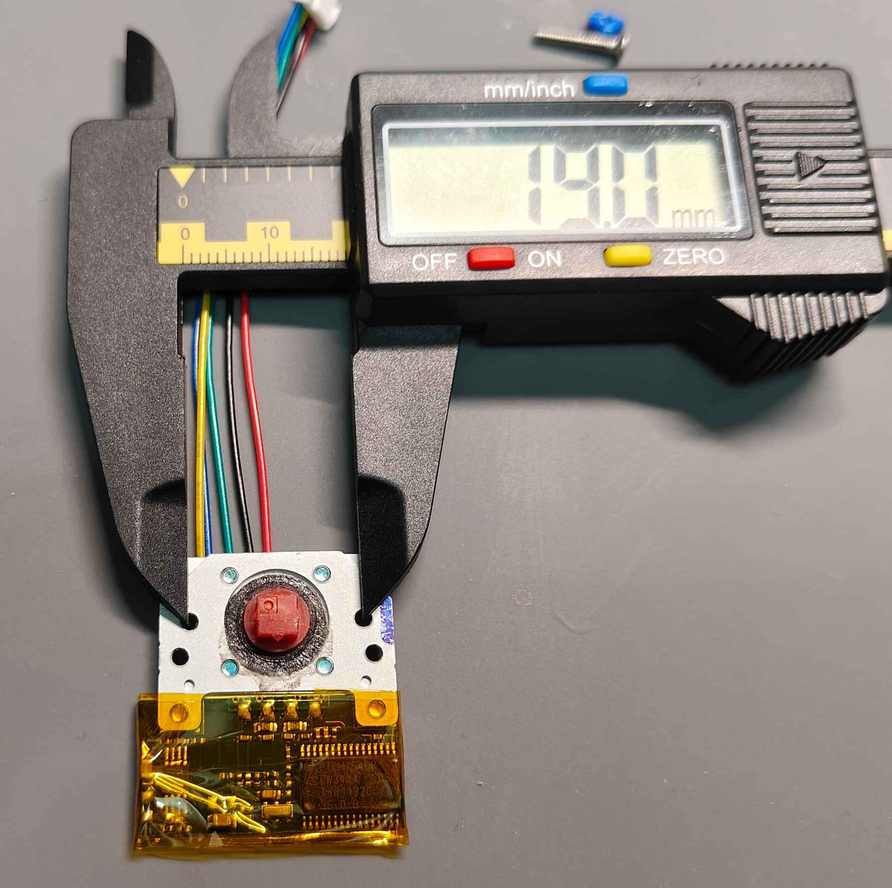
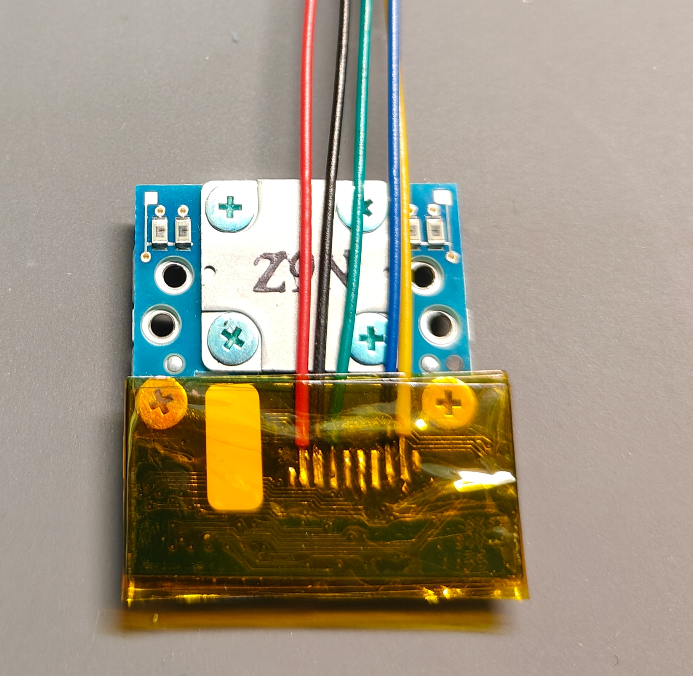

# BOM

| Component               | Model                                              | Quantity | Reference Photo |
| :---------------------- | :------------------------------------------------- | :------- | :-- |
| PCB                     | ...                                                | 2 pcs    | |
| CASE                    | ...                                                | 1 set    | |
| Micro Controller        | nice!nano V2.0                                     | 2 pcs    | |
| Reset Switch            | 4.5x4.5x5mm 3P                                     | 2 pcs    |  |
| Power Switch            | SK-12D07VG3 3P2S 3mm H                             | 2 pcs    |  |
| Pin Header              | 0.64x0.64x5.0mm                                    | 52 pcs   |
| Case Screws             | Countersunk M2x12                                  | 4 pcs    |  |
| Cover Screws            | Countersunk M2x16                                  | 8 pcs    |  |
| Trackpoint Screws       | Countersunk M2x8                                   | 4 pcs    |  |
| OLED Screws             | Countersunk M2x4                                   | 1 pc     |  |
| Micro Controller Socket | 2.54mmx13pin 3.5H                                  | 4 pcs    |
| Trackpoint Socket       | GH 1.25mmx5pin SMB                                 | 1 pc     |
| OLED Socket             | GH 1.25mmx4pin SMB                                 | 1 pc     |
| Trackpoint Cable        | GH1.25 5pin 100mm                                  | 1 pc     |
| OLED Cable              | GH1.25 4pin 100mm                                  | 1 pc     |
| Key Switch Socket       | Kailh Choc Hotswap Socket                          | 36 pcs   |
| Key Switch              | Kailh Choc v1 or v2                                | 36 pcs   |
| Key Cap                 | Kailh Choc v1 or MX style low profile (v2) key cap | 36 pcs   |
| Charging Diode          | 1N5819 SOD-323 SS14                                | 2 pcs    |
| Key Switch Diode        | 1N4148 SOD123 1206                                 | 36 pcs   |
| OLED                    | 0.91inch 128x32 I2C 4pin                           | 1 pc     |
| Battery                 | 3.7v Rechargeable Lithium battery 523450 1050mA    | 2 pcs    |
| Battery Socket          | 1.25 Flat Surface Mount Socket                     | 2 pcs    |
| Rotary Encoder          | E8H8 7.5mm 30g Encoder with Button                 | 2 pcs    |  |
| Trackpoint              | ThinkPad trackpoint PTPM754DR                      | 1 pc     |

# Trackpoint

1. Find a trackpoint module that looks similar to the following one. You may find them in old ThinkPad Laptop Keyboards.
  
2. Solder the GH1.25 Cable in the order shown in the following photo.
  